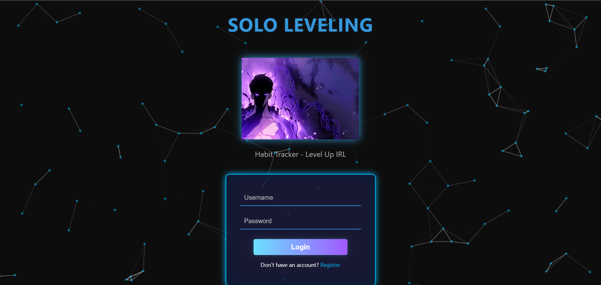
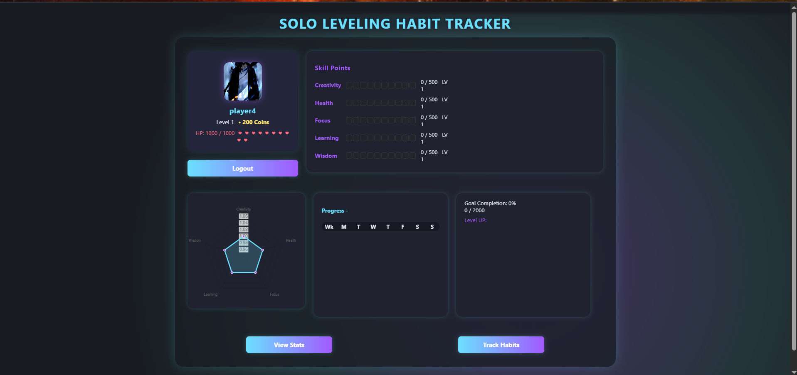

# 🗡️ Solo Leveling Themed Habit Tracker

A gamified, visually immersive habit tracker inspired by the Solo Leveling universe.  
Track your habits, level up, and visualize your progress with stunning dashboards, animations, and a unique RPG feel.

---

## 🚀 Features

- **User Registration & Login**  
  Secure authentication with a Solo Leveling style login/register experience.

- **Habit Management**  
  Add, edit, and delete habits. Mark daily progress and see your streaks.

- **Animated Dashboard**  
  - Typing effect for the title  
  - Animated backgrounds (particles, energy pulse)  
  - Smooth page transitions (fade effects)

- **Gamification**  
  Earn XP, coins, and level up as you complete habits.

- **Responsive Design**  
  Works on desktop and mobile.

---

## 🧰 Tech Stack

- **Backend:**  
  - Python  
  - Flask

- **Database:**  
  - SQLite

- **Frontend:**  
  - HTML  
  - CSS  
  - JavaScript

- **Libraries & Tools:**  
  - [particles.js](https://vincentgarreau.com/particles.js/) &mdash; animated backgrounds  
  - Flask-Migrate *(optional, for database migrations)*

---


## 🛠️ Installation & Setup

1. **Clone the repository**
```bash
git clone https://github.com/heatblaze/Habit-Tracker-Solo-Leveling-Themed.git
cd Habit-Tracker-Solo-Leveling-Themed
```

2. **Create a virtual environment**
```bash
python -m venv venv
source venv/bin/activate # On Windows: venv\Scripts\activate
```

3. **Install dependencies**
```bash
pip install -r requirements.txt
```

4. **Set up the database**
- The app uses SQLite by default. The database will be created automatically on first run.

5. **Run the app**
```bash
python app.py
```

---

## 💡 Usage

- Register a new account or log in.
- Add your habits and set targets.
- Mark habits as achieved each day.
- Watch your dashboard animate and your character level up!

---

## 🖼️ Screenshots




---

## 🤝 Contributing

Contributions, issues, and feature requests are welcome!  
Feel free to open an issue or submit a pull request.


---

## 🙏 Credits

- Inspired by [Solo Leveling](https://en.wikipedia.org/wiki/Solo_Leveling)
- Particle backgrounds by [particles.js](https://vincentgarreau.com/particles.js/)


